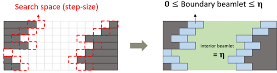
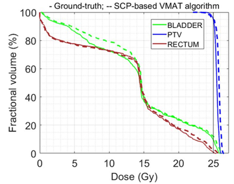
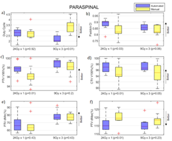

<h1 align="center">
  
</h1>

<h1 align="center"> Automated Volumetric Modulated Arc Therapy (VMAT) using Expedited Constrained Hierarchical Optimization (ECHO) </h1>

<h2 align="center">
  <a href="https://iopscience.iop.org/article/10.1088/1361-6560/ace09e/meta">PMB’2023 </a> | 
    <a href="https://iopscience.iop.org/article/10.1088/1361-6560/abee58">PMB’2021 </a> |
  <a href="https://www.iccr2024.org/papers/525886.pdf">ICCR’2024</a> |
  <a href="https://www.youtube.com/watch?v=895M6j5KjPs&t=1025s"> Edelman Competition YouTube Video</a>

</h2>

# What is Volumetric Modulated Arc Therapy (VMAT)? 
VMAT is a widely used form of radiotherapy that delivers radiation continuously as the gantry rotates around the patient. Unlike Intensity-Modulated Radiation Therapy (IMRT), which uses a limited number of fixed beams (typically 7-9), VMAT dynamically adjusts both the radiation intensity and the beam shape during the rotation. This allows for shorter treatment times, making VMAT a popular choice in clinical settings. However, planning VMAT treatments is more complex due to the large and non-convex optimization problems involved. 

# What is Expedited Constrained Hierarchical Optimization (ECHO)?
In radiotherapy, machine settings must be customized for each cancer patient, requiring extensive iterative manual tuning of parameters. This process is: 1) time-consuming, 2) labor-intensive, and 3) the plan quality is heavily dependent on the skill and experience of the planner. Our team has developed and clinically deployed an in-house automated treatment planning system called ECHO (Expedited Constrained Hierarchical Optimization). ECHO is seamlessly integrated into the FDA-approved commercial treatment planning system and is used in our daily clinical routine, with more than 10,000 patients treated to date (as of May 2024). ECHO was nominated as a finalist for the prestigious Franz Edelman 2021 award ([YouTube](https://www.youtube.com/watch?v=895M6j5KjPs&t=1025s) | [Slides](https://masoudzp.github.io/assets/Edelman-ECHO-Slides.pdf) | [Paper](https://pubsonline.informs.org/doi/abs/10.1287/inte.2021.1095) | [Podcast](https://resoundinglyhuman.com/episodes/2021-franz-edelman-competition-memorial-sloan-kettering/)).

# 1- Two Big Challenges for Automated VMAT Planning 

## 1.1- The Multi Criteria Challenge and our Hierarchical Optimization Solution
One of the challenges in radiotherapy is the inherent conflict between tumor irradiation and the sparing of nearby healthy tissue. This results in optimization problems with multiple objectives (also known as multi-objective or multiple-criteria optimization). This means, in the following general form of a radiotherapy optimization problem, the objective function $𝑓$ consists of multiple objectives: $f = (f_1,f_2,…,f_n)$

$Minimize \text{ } f(A\mathbf{x},\mathbf{x})$

Subject to $g(A\mathbf{x},\mathbf{x})\leq 0,\mathbf{x}\geq 0$

Multi-objective optimization is a well-studied subfield within operations research and mathematical optimization communities, and many techniques exist in the literature to address these problems. One such technique is the weighted-sum method, which assigns weights to the objective functions and optimizes their weighted sum: (i.e., $\sum _{i=1,..,n}w_i\times f_i$). This technique has been implemented by most commercial radiotherapy planning systems and is widely adopted in clinical practice. However, this approach requires manual and iterative fine-tuning of the weights, making radiotherapy planning a time-consuming and labor-intensive process with the quality of the plan heavily dependent on the experience of the planners.

To address this issue, we have adopted a multi-objective technique called hierarchical optimization (also known as prioritized or lexicographic optimization). In this approach, we perform optimization in two hierarchical steps:

•  Step 1: Focus on delivering the radiation dose as close as possible to the prescription dose in the tumor voxels while fulfilling all critical clinical criteria (as hard constraints)

•  Step 2: Minimize radiation to the nearby healthy tissues while preserving the results of the first step to some extent. 

For more details and information about hierarchical optimization and other existing techniques in the literature, see our papers ([PMB’2021](https://iopscience.iop.org/article/10.1088/1361-6560/abee58), [PMB’2023](https://iopscience.iop.org/article/10.1088/1361-6560/ace09e/meta)) and the references therein. We also would like to mention that an active area of research is the use of deep learning and AI to address this multi-objective challenge (see for example [Jhanwar et al.](https://iopscience.iop.org/article/10.1088/1361-6560/ac8d45) or a survey paper by [Nguyen et al.](https://pubmed.ncbi.nlm.nih.gov/36202437/)).

## 1.2- The Non-Convexity Challenge and our Sequential Convex Programming Solution

Since VMAT continuously delivers radiation as the gantry rotates around the patient, it requires the direct optimization of machine parameters (e.g., gantry and leaf motions). This is in contrast to the IMRT technique, where an effective convex optimization approach exists (i.e., a two-phase heuristic where Phase 1 optimizes the beamlet intensities and Phase 2 optimizes leaf motions). While there is a simple linear relationship between beamlet intensities and the radiation dose delivered to the patient ($𝐴𝑥=$𝑑), the relationship between machine parameters and delivered dose is complex and non-convex. 

With some assumptions, one can formulate the problem as a **Mixed Integer Programming (MIP)** problem and solve it to global optimality (see [VMAT Global Jupyter Notebook](https://github.com/PortPy-Project/PortPy/blob/master/examples/vmat_global_optimal.ipynb)). Although this approach can provide a benchmark for developing more efficient algorithms, it is computationally extensive and might take days to solve for each patient, making it impractical. 

In our papers ([PMB’2021](https://iopscience.iop.org/article/10.1088/1361-6560/abee58), [PMB’2023](https://iopscience.iop.org/article/10.1088/1361-6560/ace09e/meta)), we proposed an algorithm to solve the non-convex VMAT problem by breaking it down into a sequence of convex problems, hence the name **sequential convex programming**. The key idea is to derive a convex approximation by limiting the leaf motions at each iteration, defining the search space, and merging neighboring beamlets within this search space to create the approximation (see the figure below).

  
(**Top-left figure**) The grey and white areas represent closed and open beamlets, respectively. The regions framed by red dashed lines indicate the search space within which the leaves can move (the search space consists of two beamlets in this example). (**Top-right figure**) The white beamlets outside the search space will remain open in the next iteration with the same intensity. These can be merged into a single beamlet called an interior beamlet (green area), whose intensity (η) will be optimized as a decision variable. For each pair of neighboring beamlets within the search space (i.e., inside the red frame), we assume they contribute equally (this is our approximation). These pairs can be merged into a boundary beamlet (blue area), whose intensity will be optimized as a decision variable while ensuring it is less than η. If the optimal intensity of a boundary beamlet becomes zero, we will close that beamlet in the next iteration. If it becomes η, we will open it, and if the intensity is in between, we will partially open it. The algorithm also iteratively changes the search space (see our paper for more details). 

# Results
To evaluate the performance of the algorithm, we compared its results to the global optimal solution obtained by solving the computationally intensive Mixed Integer Programming (MIP) problem on a small prostate case.

The above figure illustrates that our algorithm can identify optimal solutions that are close to the global optimal solution.

We have also retrospectively compared the automated VMAT plans with the manually generated VMAT plans used for patient treatment for 60 patients across three different disease sites (paraspinal, oligometastatic, lung). Below are the results for 20 lung patients.

The above figure demonstrates that the automatically generated VMAT plans are superior to or comparable with the manually generated plans in terms of tumor coverage and healthy tissue sparing.

# References 

1- *Automated VMAT treatment planning using sequential convex programming: algorithm development and clinical implementation*, 
Pınar Dursun, Linda Hong, Gourav Jhanwar, Qijie Huang, Ying Zhou, Jie Yang, Hai Pham, Laura Cervino, Jean M Moran, Joseph O Deasy, Masoud Zarepisheh,
**Physics in Medicine & Biology**, [link](https://iopscience.iop.org/article/10.1088/1361-6560/ace09e/pdf)

2- *Solving the volumetric modulated arc therapy (VMAT) problem using a sequential convex programming method*, 
Pınar Dursun, Masoud Zarepisheh, Gourav Jhanwar and Joseph O Deasy
**Physics in Medicine and Biology**, [link](https://iopscience.iop.org/article/10.1088/1361-6560/abee58/pdf)
